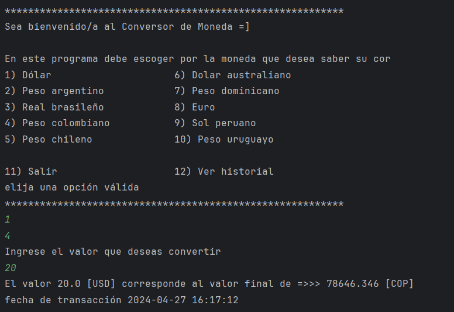
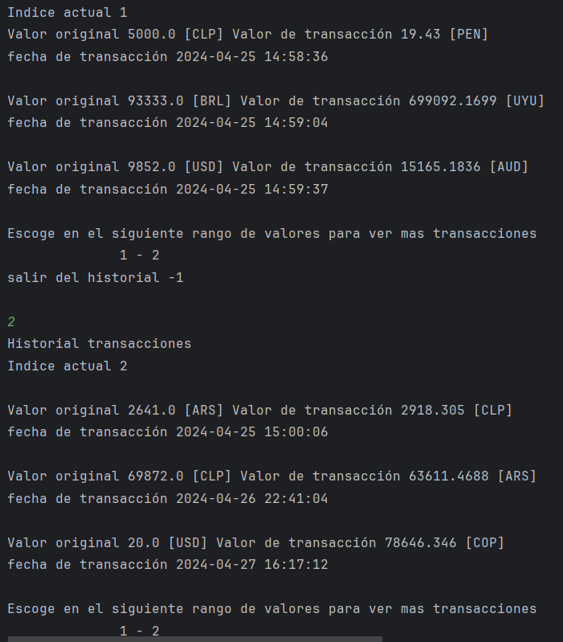

# Challenge-Java 

El proyecto tiene como objetivo realizar un conversor de monedas de terminal, en el cual puedes elegir entre 10 monedas distintas para realizar la transacción, mostrando el valor correspondiente a la nueva moneda, añadiendo la posibilidad de ver un historial de transacciones realizadas con la fecha de la transacción.

✔️ Proyecto finalizado, enviar bugs encontrados a contactos ✔️

## Demostración del proyecto

En la primera imagen se ilustran las opciones posibles de monedas para ver sus valores en la moneda original y la que se quiere conocer su valor, se usó la api Exchange Rate API para poder hacer las transacciones con valores actualizados, dando como resultado el valor de la moneda esperado.

En esta imagen se ilustra el historial de transacciones realizados por el usuario, estas toman el valor y la moneda original y la requerida por el usuario, como se puede ver también están las fechas de las transacciones ya que es importante por el cambio continuo del valor de cada divisa durante el paso del tiempo, permitiendo recorrerlo en un intervalo de 3 transacciones, en valores discretos desde el primer intervalo al último posible.

## Tecnología utilizada

* Java 17

## Desarollador del proyecto

Juan Pablo Garcia Carballo

[Linkedin](https://www.linkedin.com/in/juan-pablo-garcia-carballo/)

[Github](https://github.com/juagarciac)  [Correo](mailto:juanpablogarciacarballo@gmail.com)
